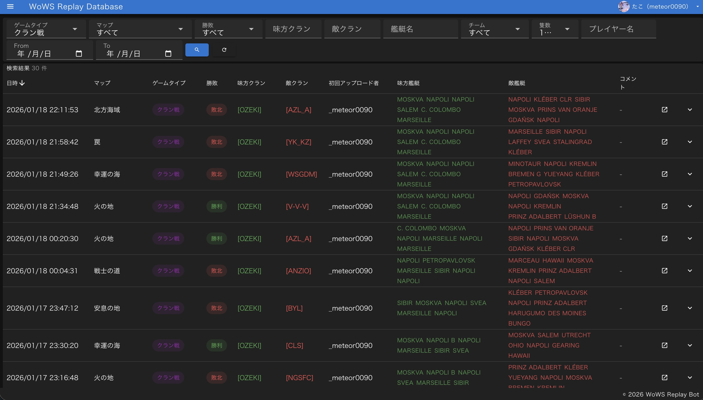
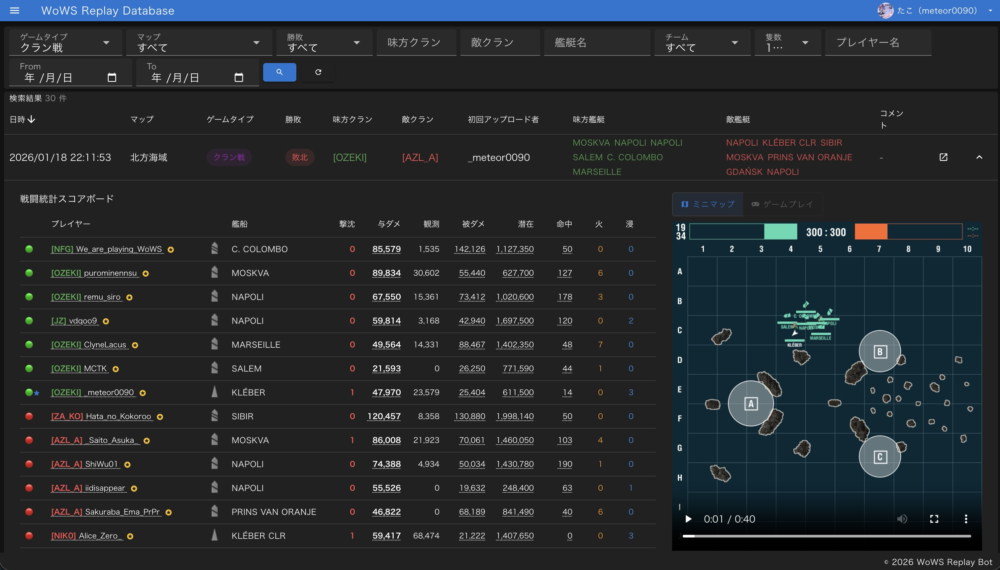
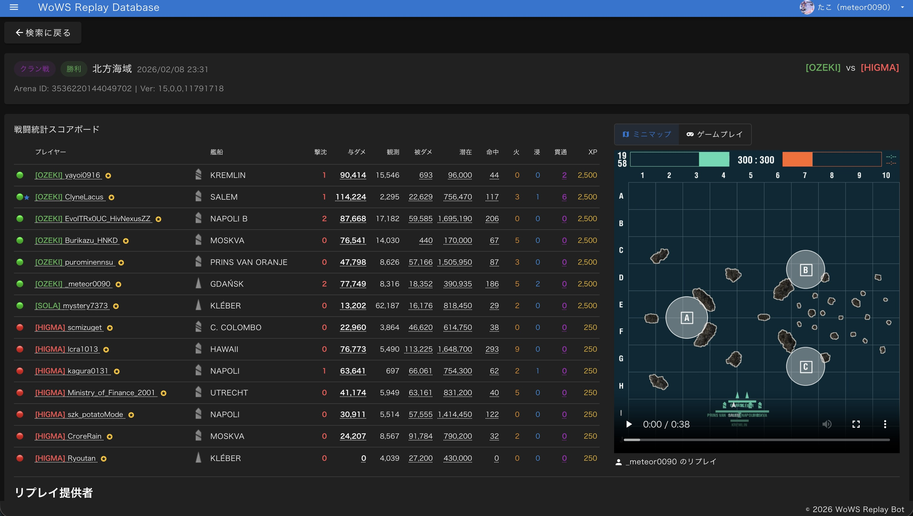
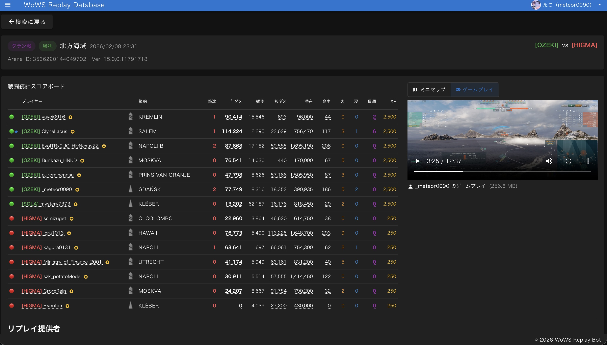

# WoWS Replay Database

World of Warshipsのリプレイファイルを管理・分析するWebアプリケーション。

## 概要

クラン戦・ランク戦・ランダム戦のリプレイを自動収集し、試合ごとの詳細統計やミニマップ動画をチームで共有できるプラットフォームです。

### Web UI

- ゲームタイプ・マップ・艦艇名・クラン・日付などの多条件検索
- 試合詳細: 全プレイヤーのダメージ・命中率・潜在ダメージ等の戦闘統計スコアボード
- リプレイデータから自動生成されたミニマップ動画の再生
- 複数プレイヤーのゲームプレイ録画（ゲーム内音声・VC・マイク音声含む）をブラウザ上で閲覧・管理

### Auto Uploader（Windowsクライアント）

- 常駐型ツール。試合終了を検知してリプレイファイルを自動アップロード
- ゲームプレイ録画機能: 試合開始〜終了を自動検知し、画面キャプチャ＋音声（ゲーム内音声・VC・マイク）を録画
- 録画した動画はリプレイと紐づけてS3にアップロードし、Web UIから再生可能

### Discord連携

- OAuth認証によるログイン
- クラン戦の試合結果をDiscordチャンネルへ自動通知

## スクリーンショット

| 検索結果一覧 | 検索結果 + 試合詳細展開 |
|:--------:|:--------:|
|  |  |

| 試合詳細（ミニマップ動画） | 試合詳細（ゲームプレイ動画） |
|:--------------:|:----------------:|
|  |  |

## 技術スタック

| コンポーネント | 技術 |
|---------------|------|
| バックエンド | Python 3.12, AWS Lambda, DynamoDB, S3 |
| リプレイ処理 | Rust (wows-replay-tool) |
| フロントエンド | Nuxt 4, Vue 3, Vuetify 3, Pinia 3, TypeScript |
| インフラ | Serverless Framework, CloudFront, API Gateway, Docker (ARM64) |
| CI/CD | GitHub Actions |

## 開発者向け情報

開発に必要な詳細情報は [CLAUDE.md](CLAUDE.md) を参照してください。

ゲームバージョンアップ時の対応手順は [docs/game-version-update.md](docs/game-version-update.md) を参照してください。

## Acknowledgments

- **[wows-toolkit](https://github.com/landaire/wows-toolkit)** by [@landaire](https://github.com/landaire) (MIT License)
  - リプレイ解析・ミニマップレンダリングのコアエンジンとして使用
  - 使用crate: `wows_replays`（リプレイパース）, `wowsunpack`（ゲームデータ抽出）, `wows_minimap_renderer`（動画レンダリング）
  - ゲームデータ抽出CLI `wows-data-mgr` を使用

サードパーティライセンスの全文は [THIRD-PARTY-LICENSES.md](THIRD-PARTY-LICENSES.md) を参照してください。

## Disclaimer

This project is not affiliated with or endorsed by Wargaming.net. "World of Warships" and related names, logos, and assets are trademarks or registered trademarks of Wargaming.net. All game-related content and intellectual property belong to their respective owners.

## ライセンス

[MIT License](LICENSE)
